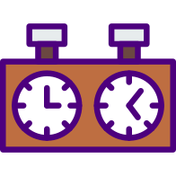

# mcChessCom - move confirmation for chess.com
Brings move confirmation in Live chess.  
Works only with new "Play" interface!

Inspired by pain from the topic https://www.chess.com/forum/view/livechess/move-confirmation

Native integration, using internal API.  
Fast toggle button on the right side panel(see screenshot).  

Settings:  
Confirm starting from N step.  
Stop confirm before N seconds.  
Alarm if not confirm after N seconds. 

Additionally:  
Confirm hotkeys - Y, Space, Enter.  
Cancel confirm - N, Esc, Backspace, Delete. 

## Installing and Running

### Procedures:

1. Check if your [Node.js](https://nodejs.org/) version is >= **14**.
2. Clone this repository.
3. Run `npm install` to install the dependencies.
4. Run `npm start`
5. Load your extension on Chrome following:
   1. Access `chrome://extensions/`
   2. Check `Developer mode`
   3. Click on `Load unpacked extension`
   4. Select the `build` folder.

## Packing

```
$ NODE_ENV=production npm run build
```
